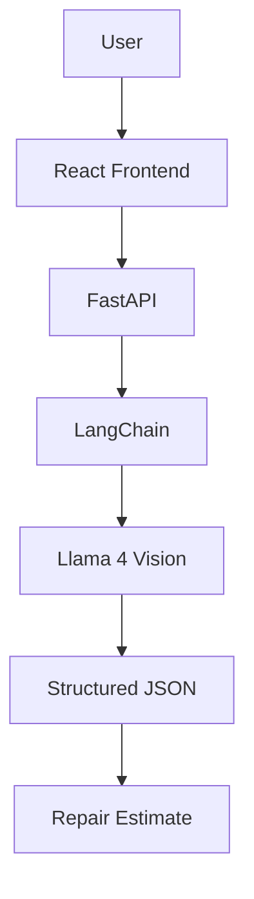
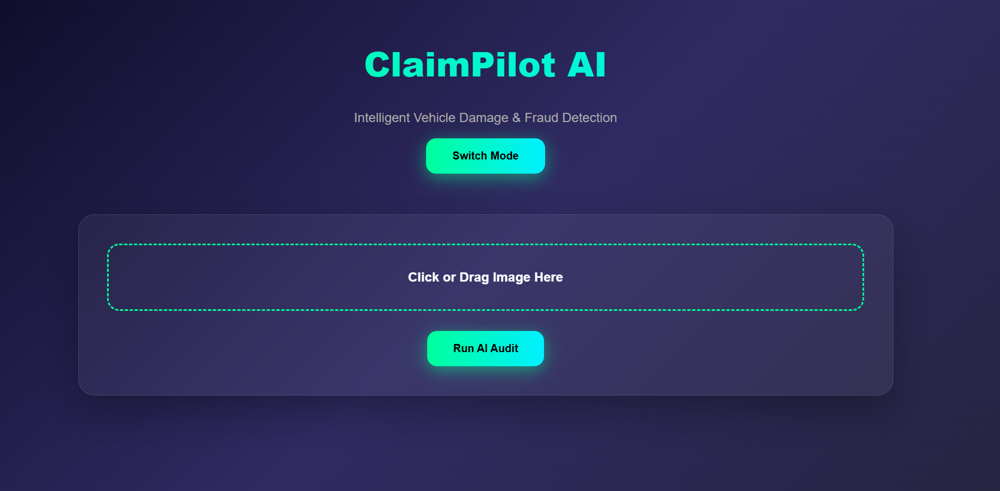
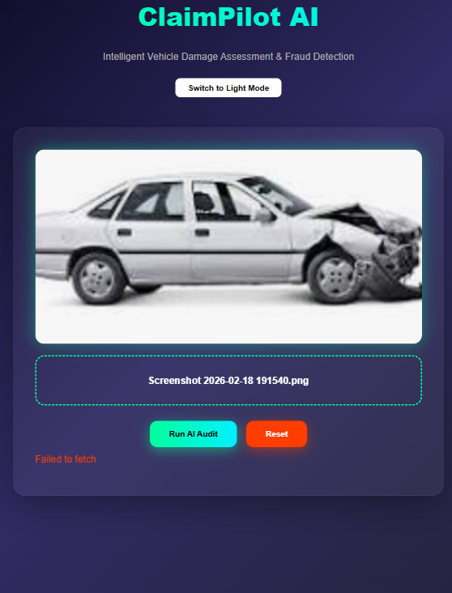
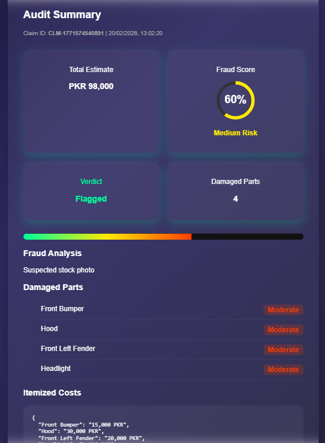
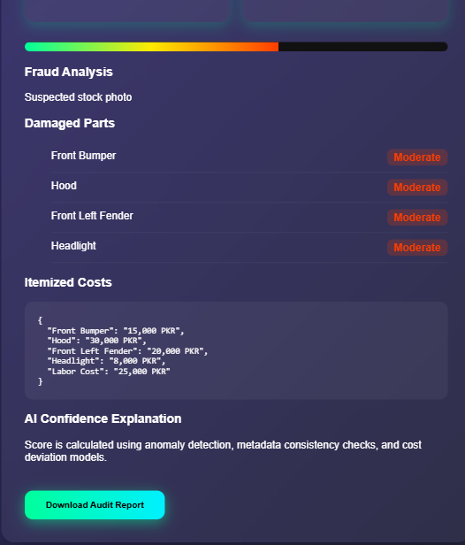

# ClaimPilot AI
Agentic Vision AI for Automated Vehicle Insurance Claims


ClaimPilot AI is an agentic vehicle insurance assessment system that automates preliminary accident surveys from a single vehicle image. It uses vision AI, structured reasoning, and local cost estimation to help insurers reduce manual inspection time, identify potentially fraudulent claims, and generate repair estimates in Pakistani Rupees (PKR).

Live demo: https://claimpilotai.vercel.app/

## Features

- Upload accident photos
- Vision-based damage detection
- Localized repair estimates in PKR
- Fraud flagging
- Structured JSON output
- FastAPI backend
- React frontend
- Llama 4 Vision integration

## Architecture



## How It Works

ClaimPilot uses a simple but reliable pipeline:

1. The user uploads a vehicle damage photo in the React app.
2. The frontend sends the image to the FastAPI backend.
3. LangChain orchestrates the vision prompt and response handling.
4. Llama 4 Vision analyzes the image for damage and fraud indicators.
5. The model returns structured JSON.
6. The backend converts that output into a repair estimate in PKR.

## Screenshots

Recruiters can understand the product flow at a glance:

1. Upload page
   
2. Damage analysis
   
3. JSON report
   
4. Cost estimate
   

## Engineering Challenges

- Maintaining deterministic outputs from the vision LLM
- Designing structured JSON responses
- Handling large image payloads
- Balancing inference speed with accuracy
- Mapping AI outputs into repair cost estimates

## My Contribution

During the hackathon, I served as the AI/Backend Lead.

My responsibilities included:

- Designing the AI workflow
- Building the FastAPI backend
- Implementing LangChain orchestration
- Integrating the vision model
- Prompt engineering
- Structuring JSON outputs
- Building the PKR cost estimation pipeline

## Future Work

- Multi-image support
- VIN decoding
- OCR on insurance documents
- Human-in-the-loop approval
- Historical claim comparison
- Fine-tuned damage detection

## Repository Structure

```text
claimpilotai/
|-- assets/
|-- backend/
|-- claimpilot-frontend/
|-- README.md
`-- .gitignore
```

## Local Development Setup

Clone the repository:

```bash
git clone https://github.com/samiyashahzad/claimpilotai.git
cd claimpilotai
```

### Frontend

```bash
cd claimpilot-frontend
npm install
npm start
```

### Backend

```bash
cd backend
pip install -r requirements.txt
uvicorn main:app --reload
```

## Tech Stack

- React
- FastAPI
- LangChain
- Groq
- Llama 4 Vision

## Live Link

https://claimpilotai.vercel.app/
