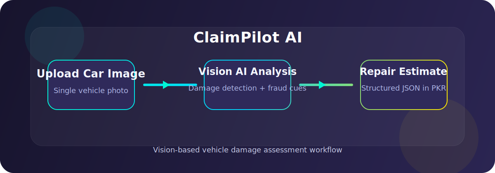
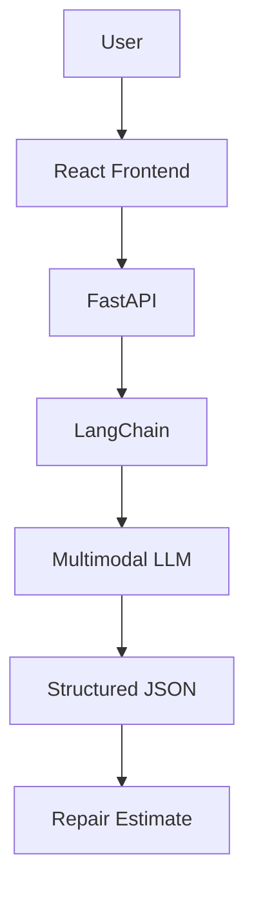

# ClaimPilot AI
Vision AI for Automated Vehicle Insurance Claims




ClaimPilot AI is a vision AI-powered vehicle insurance assessment system that automates preliminary accident surveys from a single vehicle image. It uses a multimodal LLM, structured prompting, and local cost estimation to generate repair estimates in Pakistani Rupees (PKR) and assist insurers during the initial claims assessment process.

[](https://claimpilotai.vercel.app/)

## Why ClaimPilot?

Manual vehicle inspections can take days and often require in-person assessments, leading to slower claims processing and inconsistent evaluations.

ClaimPilot AI streamlines this workflow by combining Vision AI, structured reasoning, and automated cost estimation to generate consistent preliminary assessments from a single uploaded image.

## Features

- Upload accident photos
- Vision-based damage detection
- Localized repair estimates in PKR
- Potential fraud indicators
- Structured JSON output
- FastAPI backend
- React frontend
- Multimodal LLM integration

## Architecture



## How It Works

ClaimPilot uses a simple but reliable pipeline:

1. The user uploads a vehicle damage photo in the React app.
2. The frontend sends the image to the FastAPI backend.
3. LangChain orchestrates the vision prompt and response handling.
4. The multimodal LLM analyzes the image for damage and fraud indicators.
5. The model returns structured JSON.
6. The backend converts that output into a repair estimate in PKR.

## Screenshots

Recruiters can understand the product flow at a glance:

<table>
  <tr>
    <td align="center">
      <strong>Upload</strong><br>
      
    </td>
    <td align="center">
      <strong>Damage Analysis</strong><br>
      
    </td>
  </tr>
  <tr>
    <td align="center">
      <strong>JSON Report</strong><br>
      
    </td>
    <td align="center">
      <strong>Cost Estimate</strong><br>
      
    </td>
  </tr>
</table>

## API Example

```json
{
  "damaged_parts": [
    {
      "part": "Front Bumper",
      "severity": "High",
      "estimated_cost": 42000
    }
  ],
  "itemized_costs": {
    "Front Bumper": "PKR 42,000"
  },
  "total_estimate_pkr": "PKR 98,000",
  "verdict": "Flagged",
  "fraud_analysis": "Suspected stock photo",
  "fraud_confidence_score": 60
}
```

## Engineering Challenges

- Maintaining deterministic outputs from the vision LLM
- Designing structured JSON responses
- Handling large image payloads
- Balancing inference speed with accuracy
- Mapping AI outputs into repair cost estimates

## My Contribution

During the hackathon, I served as the AI/Backend Lead.

My responsibilities included:

- Designing the AI workflow
- Building the FastAPI backend
- Implementing LangChain orchestration
- Integrating the vision model
- Prompt engineering
- Structuring JSON outputs
- Building the PKR cost estimation pipeline

## Acknowledgements

Developed during a hackathon project.

Frontend support came from my teammate.

I led the AI/backend system, including the FastAPI service, LangChain orchestration, prompt engineering, and repair estimation pipeline.

## Future Work

- Multi-image support
- VIN decoding
- OCR on insurance documents
- Human-in-the-loop approval
- Historical claim comparison
- Fine-tuned damage detection

## Repository Structure

```text
claimpilotai/
|-- assets/
|-- backend/
|-- claimpilot-frontend/
|-- LICENSE
|-- README.md
`-- .gitignore
```

## Local Development Setup

Clone the repository:

```bash
git clone https://github.com/samiyashahzad/claimpilotai.git
cd claimpilotai
```

### Frontend

```bash
cd claimpilot-frontend
npm install
npm start
```

### Backend

```bash
cd backend
pip install -r requirements.txt
uvicorn main:app --reload
```

## Tech Stack

- React - frontend interface
- FastAPI - inference API layer
- LangChain – prompt orchestration and structured output handling
- Groq - low-latency inference
- Multimodal LLM - damage analysis and fraud cues

## License

MIT License
